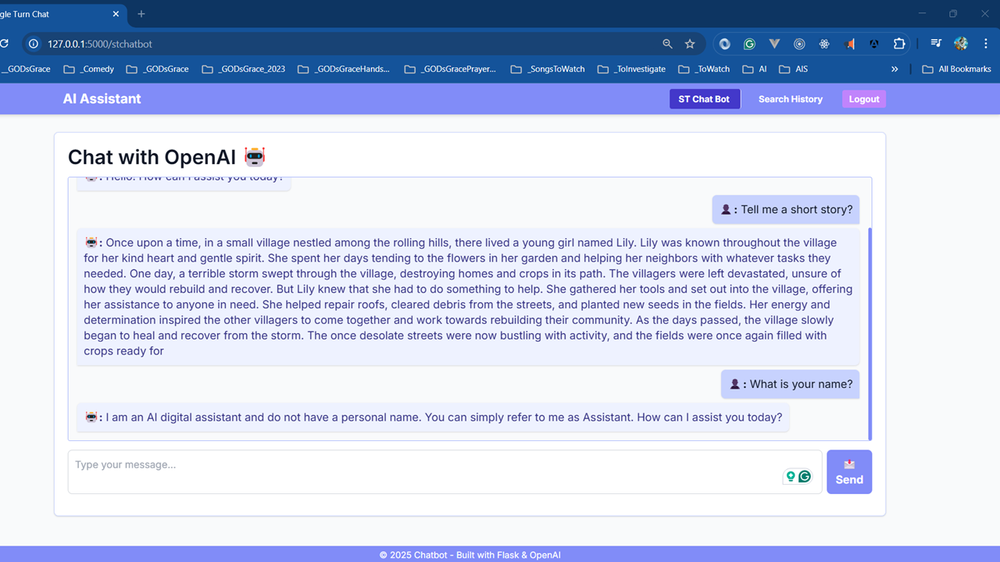

# 💬 Chat BOT with Flask and OpenAI

## Bringing AI to Life – React, Tailwind, and UI Integration

A single-turn AI chatbot built using Flask, integrated with OpenAI's GPT-3.5, and designed with a React + Tailwind CSS frontend. Built for learning, experimenting, and showcasing AI integration with modular Flask architecture.
 
### Tech Stack :

- Flask
- OpenAI API 
- React 
- Tailwind CSS 
- SQLite 
- Python-dotenv


## 🚀 UI Preview



## 🛠 Project Setup
🔧 Requirements
```powershell
    python --version #Python 3.12.5
    pip --version #pip 25.0.1
```

 
⚙️ Install & Run
```powershell
    # Create virtual environment
    python -m venv .venv
    
    # Activate environment
    .venv\Scripts\activate       # Windows
    source .venv/bin/activate    # Mac/Linux
    
    # Upgrade pip & install dependencies
    python -m pip install --upgrade pip
    pip install flask openai flask_sqlalchemy python-dotenv
    
    # Save dependencies
    pip freeze > requirements.txt
    
    # Run the app
    python app.py

```


## 📂 Project Structure


```text

        openai-chat-flask/
        ├── app.py                  # Application entry point
        ├── requirements.txt        # Dependencies
        ├── .env                    # Environment variables
        ├── README.md               # Documentation
        └── website/                # Main Flask package
            ├── __init__.py         # App factory (configures app, database, registers blueprints)
            ├── data/               # Database-related code
            │   ├── __init__.py     # (Optional) Exposes models
            │   └── models.py       # SQLAlchemy models (e.g., ChatHistory)
            ├── api/                # API endpoints
            │   ├── __init__.py     # Imports blueprint from chat.py
            │   └── chat.py         # Chat API route that interacts with OpenAI
            ├── views/              # View (template) routes
            │   ├── __init__.py     # Imports blueprint from home.py
            │   └── home.py         # Routes for Home, ST Chat Bot, and History pages
            ├── static/             # Static assets (CSS, images)
            │   ├── favicon.ico
            │   └── globalstyles.css
            └── templates/          # Jinja2 templates
                ├── base.html       # Base layout (includes navbar and footer)
                ├── navbar.html     # Navbar (included in base.html)
                ├── Footer.html     # Footer (included in base.html)
                ├── home.html       # Home page overview
                ├── stchatbot.html  # Single Turn Chat Bot page (chat interface)
                └── history.html    # Search History page (placeholder or history display)

```


---


---


## 🔗 4. Modular Design

>   "Modular design means breaking down the application into independent, manageable parts—called modules. Each module is responsible for a  specific functionality, and together they form the complete app."

### 4.1. Benefits of Modular Design

- #### Separation of Concerns
        > "We divide the app into three major concerns: Views, APIs, and Database.
        > 1. Views (views/home.py) handle rendering HTML pages .
        > 1. APIs (api/chat.py) handle JSON-based requests.
        > 1. Database (data/models.py) stores chat history.

- #### Easier Debugging & Maintenance
- #### Scalability
- #### Reusability


## 📌 5. App Initialization

📝 `app.py`

```python

        from website import create_ap

        app = create_app(

        if __name__ == '__main__':
            app.run(debug=True)

```


📝 `website/__init__.py`

```python

        def create_app():
            app = Flask(__name__)
            app.config['SQLALCHEMY_DATABASE_URI'] = "sqlite:///database.db

            from .views import views
            from .api import api
            app.register_blueprint(views, url_prefix="/")
            app.register_blueprint(api, url_prefix="/api"

            return app

```


## 📌  Blueprint Structure
### 🧭 We’ve got two main blueprints:
> - 1️⃣ Views Blueprint (views/home.py)
> - 2️⃣ API Blueprint (api/chat.py)


###  **📌View Routes** [`website/views/home.py`](./website/views/home.py)

This module contains routes responsible for rendering HTML templates. They handle user navigation and display pages such as Home, Single Turn Chat Bot, and Search History.

📂 website/views/home.py

```python

                from flask import Blueprint, render_template

                views = Blueprint("views", __name__)

                @views.route("/")
                def home():
                    return render_template("home.html")

```

####  Key Points

> 1. Defines a blueprint named views.
> 1. Contains routes like `/`, `/stchatbot`, and `/history`.
> 1. Each route calls render_template() to display the appropriate page.

###  **API** – [`website/api/chat.py`](./website/api/chat.py)

This module contains endpoints that interact with external services (like OpenAI) and return JSON responses. In this case, the /api/chat endpoint receives a user message, sends it to the OpenAI API, and returns the bot's response.


📂 website/api/chat.py

```python

                from flask import Blueprint, request, jsonify
                import openai

                api = Blueprint("api", __name__)

                @api.route("/chat", methods=["POST"])
                def chat():
                    data = request.get_json()
                    response = openai.ChatCompletion.create(
                        model="gpt-3.5-turbo",
                        messages=[{"role": "user", "content": data["message"]}],
                    )
                    return jsonify({"response": response["choices"][0]["message"]["content"]})

```

####  Key Points

> 1. Defines a blueprint named api.
> 1. Contains the /chat route for handling POST requests.
> 1. Processes JSON data, validates input, calls the OpenAI API, and returns a JSON response.


## ▶️  Run the App 

Now that the setup is complete, you can run the app and explore its navigation structure.From your terminal, simply run:

```python
            python app.py
```

Once the server is up and running, head to http://localhost:5000 in your browser.You’ll find three main routes available:


- ```/ ``` — Home Page

- ```/stchatbot ```— Chat Interface

- ```/history ```— History Page (This can be expanded to show past chat sessions)


## 💬  Showing the Chat Interface in Action

 Try asking: — for example:

```python
    What is modular design in Flask?
```

 Here’s what happens under the hood: Your message is sent to the /api/chat endpoint via a POST request, processed by OpenAI, and displayed in the UI instantly.


## 🧰 Tools Used

| Tool                  | Purpose                             |
|-----------------------|-------------------------------------|
| Python                | Backend logic                       |
| Flask                 | Web framework                       |
| OpenAI                | GPT-3.5 integration                 |
| SQLite                | Local DB for chat history           |
| React + Tailwind      | Frontend UI                         |
| VS Code / VS 2022     | Development IDEs                    |


## 🔄  SUMMARY 

1. ✅ **Frontend:** React + Tailwind for a clean, responsive chatbot UI
2.  ✅ **Backend:** Flask structured using modular Blueprints and an App Factory pattern
3.  ✅ **Integration:** Connected the UI to OpenAI’s GPT model for dynamic, smart responses
4.  ✅ **Architecture:** Fully scalable and production-ready — great for extending into multi-turn chatbots, AI dashboards, or other intelligent applications
 


### Please refer to the [**Source Code**](https://github.com/Manozgna19/CHATBOT-FLASK-OPENAI-.git)  for more details

For any further queries, feel free to connect via [**LinkedIn**](https://www.linkedin.com/in/manozgna-m)

